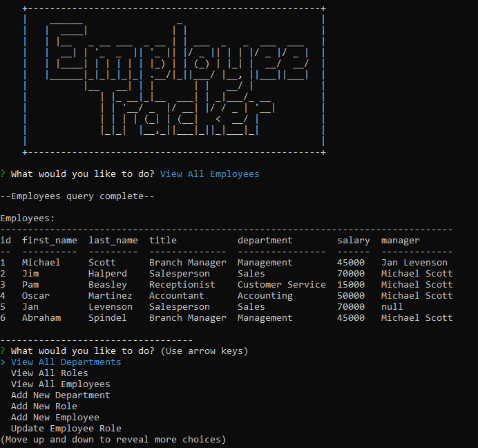

# employee-tracker
 
   
  
A database solution for managing a company's employees using Node.JS, express, inquirer, and MySQL.
 
---

## Table of Contents
  
* [User Story](#User-Story)
* [Usage](#Usage)
* [App in Action](#App-in-Action)
* [Example](#Example)
* [Contents](#Contents)
* [Author](#Author)
* [License](#License)
  
---

## User Story
>As a business owner
>I want to be able to view and manage the departments, roles, and employees in my company
>So that I can organize and plan my business

---

## Usage 
  
This is a "Command Line Interace" application running in a Node.js runtime environment. Users enter team member information and an HTML file will be rendered and saved to the output directory!

---

## App in Action
Basic Functionality:  

## Example

---

## Contents
**Files include:**
* Main index.JS page
* Sample Screenshot of App 
* App Demo image, GIF
* SQL Schema, SQL Seeds
* Node.js JSON Packages
* This README file

---

## Author
Abraham Spindel  

---

## License
* [Node.js Project Licensing (MIT)](https://raw.githubusercontent.com/nodejs/node/master/LICENSE)   
* [express Licensing (MIT)](https://github.com/expressjs/express/blob/HEAD/LICENSE)   
* [MySQL npm Licensing (MIT)](https://github.com/mysqljs/mysql/blob/master/License)  
* Node Package Manager (npm) [Artistic License 2.0](https://www.npmjs.com/policies/npm-license)  
* npm Inquirer: Copyright (c) 2016 Simon Boudrias (twitter: @vaxilart) Licensed under the [MIT license](https://choosealicense.com/licenses/mit/)  
* npm Console.table: Copyright (c) 2014 Gleb Bahmutov  Licensed under the [MIT license](https://choosealicense.com/licenses/mit/)  

